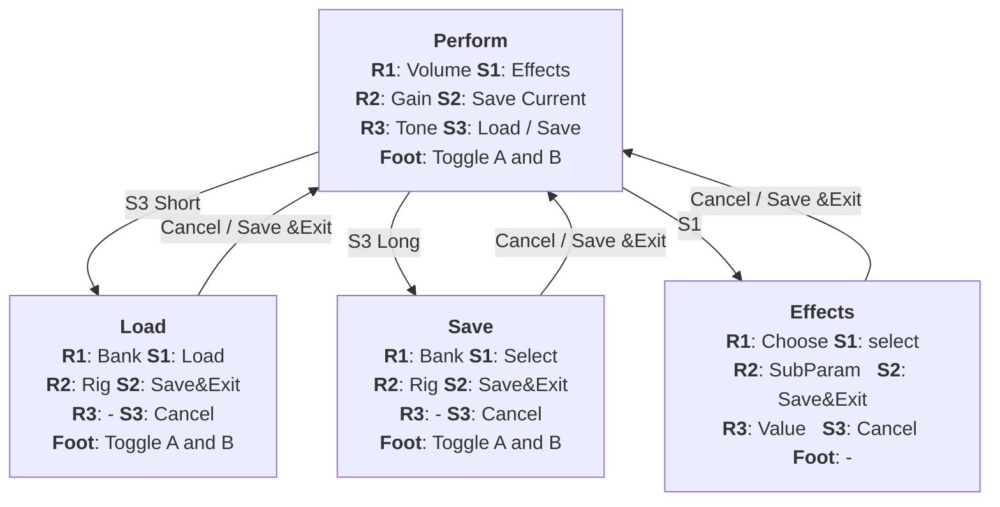
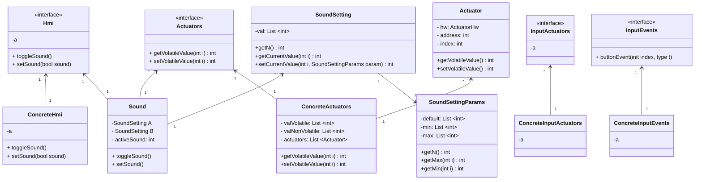
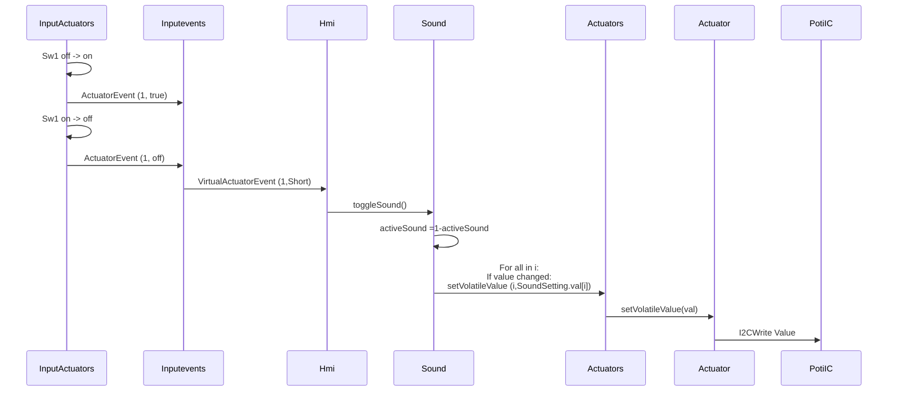

```mermaid
  
  graph TD
   
      A["`**Perform**
    **R1**: Volume **S1**: Effects
    **R2**: Gain   **S2**: Save Current 
    **R3**: Tone   **S3**: Load / Save 
    **Foot**: Toggle A and B`"]
    
  B["`**Effects**
    **R1**: Choose **S1**: select
    **R2**: SubParam   **S2**: Save&Exit
    **R3**: Value   **S3**: Cancel 
    **Foot**: -`"]

  C["`**Load**
    **R1**: Bank **S1**: Load
    **R2**: Rig   **S2**: Save&Exit 
    **R3**: -   **S3**: Cancel 
    **Foot**: Toggle A and B`"]

  D["`**Save**
    **R1**: Bank **S1**: Select
    **R2**: Rig  **S2**: Save&Exit 
    **R3**: -   **S3**: Cancel 
    **Foot**: Toggle A and B`"]

   B -- Cancel / Save &Exit --> A
   C -- Cancel / Save &Exit --> A
   D -- Cancel / Save &Exit --> A
   A -- S3 Short --> C
   A -- S3 Long --> D
   A -- S1  --> B


```

### Main Classes

```mermaid

classDiagram
direction BT


class `Hmi`{
    -a
    + toggleSound()
    + setSound(bool sound)

}
class `Actuators`{

    + getVolatileValue(int i) int
    + setVolatileValue(int i) int 

}


class `InputEvents`{

+ buttonEvent (init index, type t)
}
class InputActuators{
-a
}

 <<interface>>Hmi
 <<interface>>Actuators
 <<interface>>InputActuators
<<interface>>InputEvents


class `ConcreteHmi`{
    -a
    + toggleSound()
    + setSound(bool sound)

}


class `Actuator`{
    - hw: ActuatorHw
    - address: int
    - index: int
    +getVolatileValue() int
    +setVolatileValue() int 
}
class Sound{
 -SoundSetting A
- SoundSetting B
- activeSound: int
+ toggleSound()
+ setSound()
}


class ConcreteInputActuators{
-a
}
class `ConcreteInputEvents`{

-a
}


class `SoundSetting`{
    -val: List ~int~
    +getN() int
    +getCurrentValue(int i) int
    +setCurrentValue(int i, SoundSettingParams param) int
}

class `SoundSettingParams`{
    -default: List ~int~
    -min: List ~int~
    -max: List ~int~
    +getN() int
    +getMax(int i) int
    +getMin(int i) int
}
class `ConcreteActuators`{
    - valVolatile: List ~int~
    - valNonVolatile: List ~int~
    - actuators: List ~Actuator~
    +getVolatileValue(int i) int
    +setVolatileValue(int i) int 
}


   SoundSettingParams "1" <-- "*"  SoundSetting 
 ConcreteActuators"1" --> "1"Actuators
 Sound"1" --> "1"Actuators
ConcreteActuators"1" --> "*"Actuator
ConcreteInputActuators"1" --> "*"InputActuators
Sound "1" --> "1"Hmi
ConcreteHmi "1" --> "1"Hmi
 Sound  "1" -->  "1" SoundSetting
ConcreteInputEvents "1" --> "1"InputEvents

```
### Button Sequence Example

```mermaid
sequenceDiagram
    InputActuators ->> InputActuators: Sw1 off -> on
    InputActuators ->> Inputevents:  ActuatorEvent (1, true)
    InputActuators ->> InputActuators: Sw1 on -> off
    InputActuators ->> Inputevents:  ActuatorEvent (1, off)
    Inputevents ->> Hmi: VirtualActuatorEvent (1,Short)
    Hmi ->>Sound: toggleSound()
    Sound ->> Sound: activeSound =1-activeSound
    Sound ->> Actuators: For all in i: <br>If value changed: <br> setVolatileValue (i,SoundSetting.val[i])
    Actuators ->> Actuator: setVolatileValue(val)
    Actuator ->> PotiIC: I2CWrite Value
```
