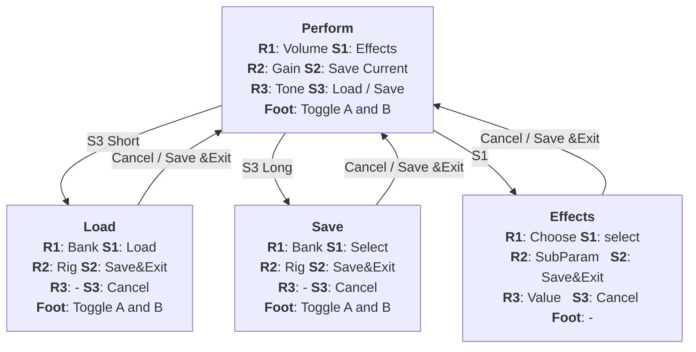
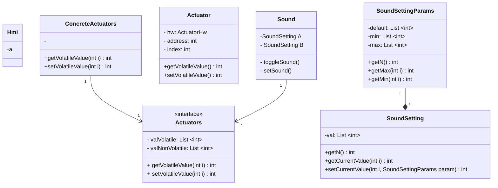

```mermaid
  
  graph TD
   
      A["`**Perform**
    **R1**: Volume **S1**: Effects
    **R2**: Gain   **S2**: Save Current 
    **R3**: Tone   **S3**: Load / Save 
    **Foot**: Toggle A and B`"]
    
  B["`**Effects**
    **R1**: Choose **S1**: select
    **R2**: SubParam   **S2**: Save&Exit
    **R3**: Value   **S3**: Cancel 
    **Foot**: -`"]

  C["`**Load**
    **R1**: Bank **S1**: Load
    **R2**: Rig   **S2**: Save&Exit 
    **R3**: -   **S3**: Cancel 
    **Foot**: Toggle A and B`"]

  D["`**Save**
    **R1**: Bank **S1**: Select
    **R2**: Rig  **S2**: Save&Exit 
    **R3**: -   **S3**: Cancel 
    **Foot**: Toggle A and B`"]

   B -- Cancel / Save &Exit --> A
   C -- Cancel / Save &Exit --> A
   D -- Cancel / Save &Exit --> A
   A -- S3 Short --> C
   A -- S3 Long --> D
   A -- S1  --> B


```

### Main Classes

```mermaid
classDiagram

class `Hmi`{
    -a
}

class Sound{
 -SoundSetting A
- SoundSetting B
- toggleSound()
- setSound()
}


class `Actuator`{
    - hw: ActuatorHw
    - address: int
    - index: int
    +getVolatileValue() int
    +setVolatileValue() int 
}


class `ConcreteActuators`{
    -
    +getVolatileValue(int i) int
    +setVolatileValue(int i) int 
}

class `Actuators`{
    - valVolatile: List ~int~
    - valNonVolatile: List ~int~
    + getVolatileValue(int i) int
    + setVolatileValue(int i) int 

}
 <<interface>>Actuators


class `SoundSettingParams`{
    -default: List ~int~
    -min: List ~int~
    -max: List ~int~
    +getN() int
    +getMax(int i) int
    +getMin(int i) int
}

class `SoundSetting`{
    -val: List ~int~
    +getN() int
    +getCurrentValue(int i) int
    +setCurrentValue(int i, SoundSettingParams param) int
}

   SoundSettingParams "1" --* "*"  SoundSetting 
 ConcreteActuators"1" --> "1"Actuators
 Sound"1" --> "*"Actuators

```
