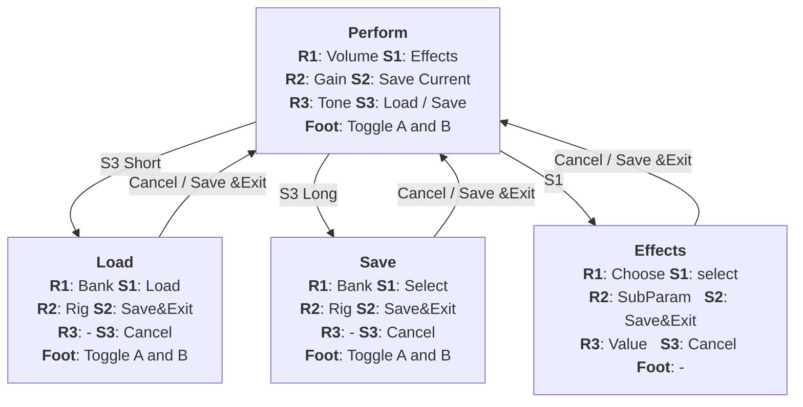
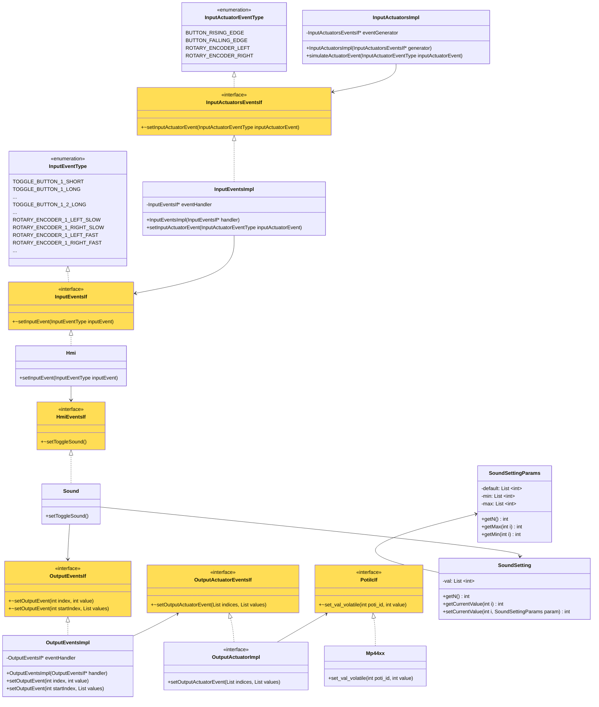

```mermaid
  
  graph TD
   
      A["`**Perform**
    **R1**: Volume **S1**: Effects
    **R2**: Gain   **S2**: Save Current 
    **R3**: Tone   **S3**: Load / Save 
    **Foot**: Toggle A and B`"]
    
  B["`**Effects**
    **R1**: Choose **S1**: select
    **R2**: SubParam   **S2**: Save&Exit
    **R3**: Value   **S3**: Cancel 
    **Foot**: -`"]

  C["`**Load**
    **R1**: Bank **S1**: Load
    **R2**: Rig   **S2**: Save&Exit 
    **R3**: -   **S3**: Cancel 
    **Foot**: Toggle A and B`"]

  D["`**Save**
    **R1**: Bank **S1**: Select
    **R2**: Rig  **S2**: Save&Exit 
    **R3**: -   **S3**: Cancel 
    **Foot**: Toggle A and B`"]

   B -- Cancel / Save &Exit --> A
   C -- Cancel / Save &Exit --> A
   D -- Cancel / Save &Exit --> A
   A -- S3 Short --> C
   A -- S3 Long --> D
   A -- S1  --> B


```

### Main Classes

```mermaid
classDiagram
direction TD
    class InputActuatorEventType {
        <<enumeration>>
        BUTTON_RISING_EDGE
        BUTTON_FALLING_EDGE
        ROTARY_ENCODER_LEFT
        ROTARY_ENCODER_RIGHT
    }

    class InputEventType {
        <<enumeration>>
        TOGGLE_BUTTON_1_SHORT
        TOGGLE_BUTTON_1_LONG
        ...
        TOGGLE_BUTTON_1_2_LONG
        ...
        ROTARY_ENCODER_1_LEFT_SLOW
        ROTARY_ENCODER_1_RIGHT_SLOW
        ROTARY_ENCODER_1_LEFT_FAST
        ROTARY_ENCODER_1_RIGHT_FAST
        ...
    }

    class InputActuatorsEventsIf {
        <<interface>>
        +~setInputActuatorEvent(InputActuatorEventType inputActuatorEvent)
    }
    style InputActuatorsEventsIf fill:#FFDD55

    class InputEventsIf {
        <<interface>>
        +~setInputEvent(InputEventType inputEvent)
    }
    style InputEventsIf fill:#FFDD55

    class HmiEventsIf {
        <<interface>>
        +~setToggleSound()
    }
   style HmiEventsIf fill:#FFDD55

    class OutputEventsIf {
        <<interface>>
        +~setOutputEvent(int index, int value)
        +~setOutputEvent(int startIndex, List<int> values)
    }
    style OutputEventsIf fill:#FFDD55

    class PotiIcIf {
        <<interface>>
        +~set_val_volatile(int poti_id, int value)
    }
    style PotiIcIf fill:#FFDD55

    class OutputActuatorEventsIf {
        <<interface>>
        +~setOutputActuatorEvent(List <int> indices, List <int> values)
    }
    style OutputActuatorEventsIf fill:#FFDD55

    class InputActuatorsImpl {
        -InputActuatorsEventsIf* eventGenerator
        +InputActuatorsImpl(InputActuatorsEventsIf* generator)
        +simulateActuatorEvent(InputActuatorEventType inputActuatorEvent)
    }

    class InputEventsImpl {
        -InputEventsIf* eventHandler
        +InputEventsImpl(InputEventsIf* handler)
        +setInputActuatorEvent(InputActuatorEventType inputActuatorEvent)
    }

    class OutputEventsImpl {
        -OutputEventsIf* eventHandler
        +OutputEventsImpl(OutputEventsIf* handler)
        +setOutputEvent(int index, int value)
        +setOutputEvent(int startIndex, List<int> values)
    }

    class OutputActuatorImpl {
        <<interface>>
        +setOutputActuatorEvent(List <int> indices, List <int> values)
    }

    class Hmi {
        +setInputEvent(InputEventType inputEvent)
    }

    class Sound {
        +setToggleSound()
    }

    class Mp44xx {
       +set_val_volatile(int poti_id, int value)
    }

    class `SoundSetting`{
    -val: List ~int~
    +getN() int
    +getCurrentValue(int i) int
    +setCurrentValue(int i, SoundSettingParams param) int
    }

    class `SoundSettingParams`{
        -default: List ~int~
        -min: List ~int~
        -max: List ~int~
        +getN() int
        +getMax(int i) int
        +getMin(int i) int
    }

    InputActuatorsEventsIf <|.. InputEventsImpl
    InputEventsIf <|.. Hmi
    Hmi --> HmiEventsIf
    HmiEventsIf <|.. Sound
    InputEventType <|.. InputEventsIf
    InputActuatorEventType <|.. InputActuatorsEventsIf
    InputActuatorsImpl --> InputActuatorsEventsIf
    InputEventsImpl --> InputEventsIf
    OutputEventsIf <|.. OutputEventsImpl
    OutputActuatorEventsIf <--  OutputEventsImpl
    OutputActuatorEventsIf <|.. OutputActuatorImpl
    Sound --> OutputEventsIf
    SoundSettingParams  <--  SoundSetting 
    Sound --> SoundSetting
    PotiIcIf <--  OutputActuatorImpl
    PotiIcIf <|.. Mp44xx

```

